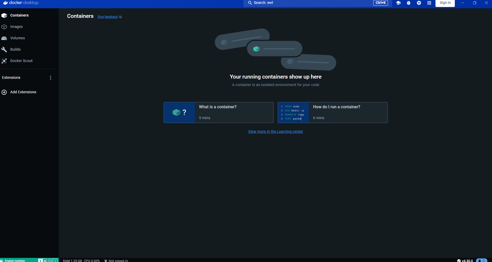
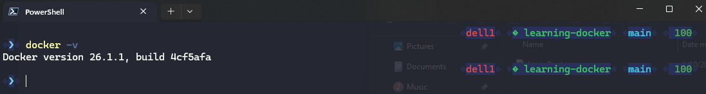
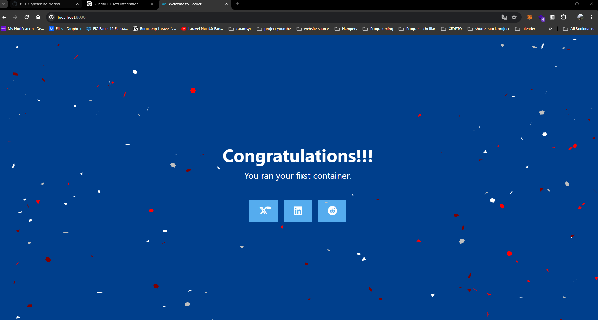
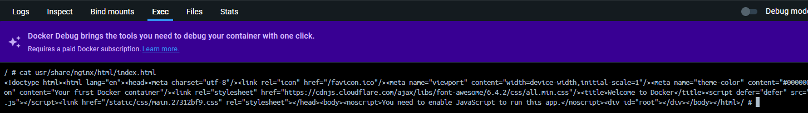
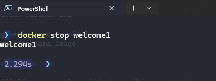

# learning-docker

## Hasil Instalasi docker



## Version Docker Installed



## Running Image Docker docker/welcome-to-docker

Install dengan perintah dibawah ini

1. -d untuk running background terminal
2. --name untuk pemberian nama Image
3. 8080:80 port

```sh
docker run -d -p 8080:80 --name welcome1 docker/welcome-to-docker
```

## Running Preview

git

## Cek Log Running container

1. welcome 1 nama file containernya
2. tail untuk cek logs
3. 20 jumlah log terakhir

```sh
docker logs -f --tail 20 welcome1
```

git

## execute file in container

1. Lakukan exec di docker secara langsung

```sh
cat /usr/share/nginx/html/index.html
```

git

## docker stop container service

```sh
 docker stop welcome1
```

git
