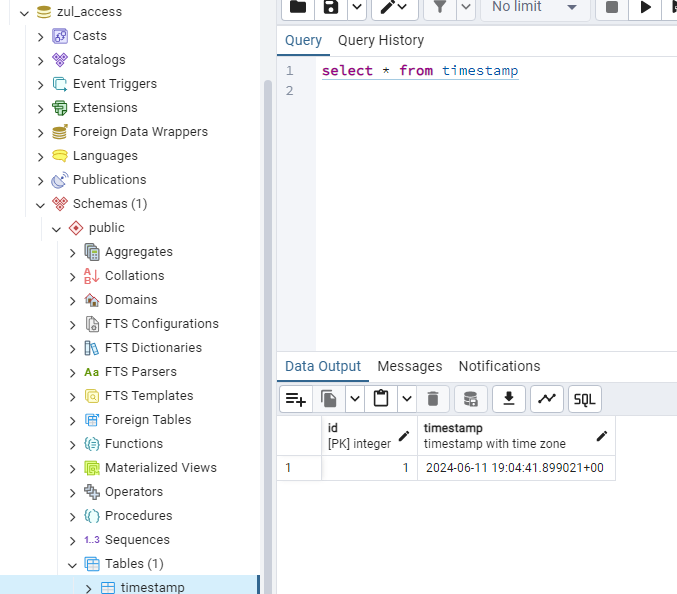

# Dokumentasi Docker Compose

Proyek ini menggunakan Docker Compose untuk mengelola layanan yang diperlukan untuk menjalankan aplikasi Go dengan database PostgreSQL. Berikut adalah struktur folder dan instruksi penggunaan:

## Struktur Folder:

```markdown
project-docker-compose/
│
├── .env
├── docker-compose.yml
│
└── go-sample_postgree/
	│
	├── dockerfile
	├── go.mod
	├── go.sum
	└── main.go
```

## Prasyarat

- [Docker](https://www.docker.com/) harus diinstal di sistem Anda.
- [Go](https://golang.org/dl/) (untuk pengembangan lokal, tidak wajib jika hanya ingin membangun image Docker).

### 1. Setup database name and column

Di sini saya memberikan nama database zul_access dan nama table timestamp serta column table id dan timestamp



### 2. Setup Project Golang

Disini saya menggunakan fiber sebagai framework web di project golang ini, saya membuat 2 route yang pertama route "/" dan "/ping", untuk route /ping saya memberi logic ketika di akses akan meng insert data timestamp waktu sesuai kapan dia akses route tersebut

```go
package main

import (
	"database/sql"
	"fmt"
	"log"
	"os"
	"time"

	"github.com/gofiber/fiber/v3"
	_ "github.com/lib/pq"
)

func main() {
	// Membaca variabel lingkungan
	dbHost := os.Getenv("DB_HOST")
	dbPort := os.Getenv("DB_PORT")
	dbUser := os.Getenv("DB_USER")
	dbPassword := os.Getenv("DB_PASS")
	dbName := os.Getenv("DB_NAME")

	// Membuat string koneksi database
	connStr := fmt.Sprintf("postgres://%s:%s@%s:%s/%s?sslmode=disable",
		dbUser, dbPassword, dbHost, dbPort, dbName)

	// Membuat koneksi database
	db, err := sql.Open("postgres", connStr)
	if err != nil {
		log.Fatalf("Gagal terhubung ke database: %v\n", err)
	}
	defer db.Close()

	// Membuat aplikasi Fiber
	app := fiber.New()

	// Rute untuk "/"
	app.Get("/", func(c fiber.Ctx) error {

		_, err := http.Get("http://localhost:4331")

		if err != nil {
			log.Println("Ping failed", err)
			return c.SendString("Allah tidak membebani seseorang melainkan sesuai dengan kesanggupannya. (Q.S Al Baqarah: 286")
		}
		log.Printf("Ping succesful")
		return c.SendString("Pong!")
	})

	// Rute untuk "/ping"
	app.Get("/ping", func(c fiber.Ctx) error {

		// Menyisipkan data timestamp saat ini ke dalam kolom timestamp
		_, err = db.Exec("INSERT INTO timestamp (timestamp) VALUES ($1)", time.Now())
		if err != nil {
            log.Printf("Ping failed :%v\n", err)
			return c.SendString("Ping failed")
		}

		// Mengirimkan respons jika semua operasi berhasil
        log.Printf("Ping successful")
		return c.SendString("Pong")
	})

	// Memulai server
	log.Fatal(app.Listen(":77"))
}


```

### 3. Create Dockerfile to build and run

Konfigurasi seperti dibawah ini

```go
FROM golang:1.22.3

# Set destination for COPY
WORKDIR /app

# Copy go.mod and execute to download Go modules
COPY go.mod go.sum ./
RUN go mod download


COPY *.go ./

# Build
RUN CGO_ENABLED=0 GOOS=linux go build -o /go_service


EXPOSE 77

# Run
CMD [ "/go_service" ]
```

### 3. Create Docker-compose.yml

- **gosvc_container**: nama container golang
- **port**: port 77 to host port 4331
- **image_postgree**: latest
- **dbsvc_container**: nama container postgree database
- **net_mycompose_zul**: network name
- **vol_mycompose_zul**: volume name
- **pgamdmin_port**: 5432

```go
version: "3.8"

name: project-my-compose

services:
  app:
    container_name: gosvc_container
    environment:
      - DB_HOST=${DB_HOST}
      - DB_USER=${DB_USER}
      - DB_PASS=${DB_PASS}
      - DB_NAME=${DB_NAME}
      - DB_PORT=${DB_PORT}
    env_file:
      - .env
    build:
      context: ./go-sample_postgree
      dockerfile: dockerfile
    ports:
      - 4331:77
    networks:
      - net_mycompose_zul
    depends_on:
      postgresdb:
        condition: service_healthy

  postgresdb:
    image: postgres:latest
    container_name: dbsvc_container
    environment:
      - POSTGRES_HOST=${DB_HOST}
      - POSTGRES_USER=${DB_USER}
      - POSTGRES_PASSWORD=${DB_PASS}
      - POSTGRES_NAME=${DB_NAME}
    env_file:
      - .env
    ports:
      - "5432:5432"
    volumes:
      - vol_mycompose_zul:/var/lib/postgresql/data
    networks:
      - net_mycompose_zul
    healthcheck:
      test: ["CMD-SHELL", "pg_isready -U ${DB_USER} -d ${DB_NAME}"]
      interval: 10s
      timeout: 5s
      retries: 5

volumes:
  vol_mycompose_zul:

networks:
  net_mycompose_zul:
    driver: bridge


```

### 3. Run Docker Compose

Run docker compose dan cek apakah route / dan /ping dapat di akses dan insert data ke database

1. Running Compose


2. Cek Logs kedua container apa sudah berjalan dengan baik dan dapat digunakan


3. Cek apa bisa masuk ke root webnya dan /ping


4. Cek route /ping dan apa sudah bertambah di databasenya


