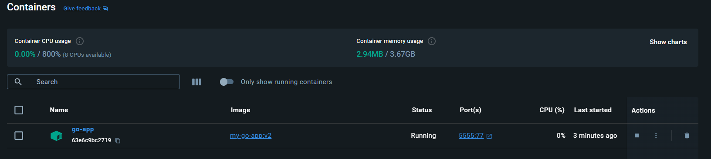

# My Go App

## Deskripsi

`My Go App` adalah contoh aplikasi Go sederhana yang dikemas dalam container Docker. Aplikasi ini menggunakan Docker untuk mempermudah distribusi dan penerapan (deployment).

## Struktur Proyek

- **Dockerfile**: File konfigurasi untuk membangun image Docker.
- **go.mod**: File modul Go yang berisi informasi tentang dependensi.
- **go.sum**: File yang melacak versi yang digunakan oleh dependensi.
- **main.go**: Kode sumber utama aplikasi Go.

## Prasyarat

- [Docker](https://www.docker.com/) harus diinstal di sistem Anda.
- [Go](https://golang.org/dl/) (untuk pengembangan lokal, tidak wajib jika hanya ingin membangun image Docker).

## Langkah-langkah

### 1. Sama kan versi Golang 1.21

Kloning repositori `my-go-app` ke direktori lokal Anda:

<<<<<<< HEAD:project-my-dockerfile/README.md


### 2. File golang untuk mencetak di html dan console"

Setting konfigurasi port menjadi 77

Hasilnya akan terlihat seperti ini:

```go
package main

import (
	"fmt"
	"log"

	"github.com/gofiber/fiber/v3"
)

func main() {

	app := fiber.New()

	app.Get("/", func(c fiber.Ctx) error {
		fmt.Println("Ouch ")
		return c.SendString("The true measure of a shinobi is not how he lives, but how he dies. - Jiraiya👋!")
	})

	log.Fatal(app.Listen(":77"))

}
=======
```bash
git clone [https://github.com/username/my-go-app.git](https://github.com/zul1996/learning-docker.git)
cd learning-docker
>>>>>>> 90a9393bbdb464e658e2e3ef550d3005b4f1cfe5:project-my-dockerfile/Readme.md
```

### 3. Buat Dockerfile "

Buat Dockerfile dengan konfigurasi dibawah ini menggunakan versi 1.21 expose target 77 dan image akan diberi nama my-go-app

```bash

FROM golang:1.21

# Set destination for COPY
WORKDIR /myapp

RUN go version

# Copy go.mod and execute to download Go modules
COPY go.mod go.sum ./
RUN go mod download

COPY authors.md ./


COPY links.md ./

COPY *.go ./

# Build
RUN CGO_ENABLED=0 GOOS=linux go build -o /my-go-app


EXPOSE 77

# Run
CMD [ "/my-go-app" ]
```

### 4. Buat Dockerfile image dengan Nama "my-go-app-v2"

```bash
docker build -t my-go-app:v2 .
```


### 3. Jalankan Container

Setelah image Docker berhasil dibangun, Anda dapat menjalankan container dari image tersebut di latar belakang dan memetakan port 8080:

```bash
docker run -d --name go-app -p 5555:77 my-go-app:v2

```


### 4. Cek Running Program n logs

Buka browser dan akses localhost:5555


### 5. Cek logs and akses shell didalam container

melihat atau edit file di container sangat tidak direkomendasikan,, kita berikan contoh memakai logs dan cat, logs untuk melihat kerja container golang kita, cat untuk mencetak file yang berada di golang kita

```bash
 docker logs go-app
```

```bash
 docker exec -it go-app cat ./AUTHORS.md
```

```bash
 docker exec -it go-app cat ./LINKS.md
```


### 6. Final file di docker desktop



